# Football Player Salary Prediction: A Machine Learning Approach

## Using FIFA Attributes, Match Statistics, and Market Values with Range-Based Prediction

---

## Abstract

This project presents a machine learning system for predicting the annual salaries of professional football players in the top five European leagues. We integrate data from four sources -- SoFIFA player attributes, API-Football match statistics, Transfermarkt market valuations, and Capology salary records -- to build a dataset of **1,008 players** with **36 engineered features**. We train and evaluate ten models including Ridge Regression, Lasso, Random Forest, Gradient Boosting, XGBoost, and a Stacking Ensemble. A novel **range-based prediction approach** using Random Forest tree variance produces salary intervals rather than point estimates, achieving **73.3% range accuracy** with a 30% tolerance threshold on the test set. The system is deployed as a RESTful API with LLM-powered natural language explanations using Google Gemini.

**Keywords:** Salary Prediction, Random Forest, Ensemble Learning, Explainable AI, Sports Analytics, Range Prediction

---

## Table of Contents

1. [Introduction](#1-introduction)
2. [Related Work](#2-related-work)
3. [Data Collection and Integration](#3-data-collection-and-integration)
4. [Methodology](#4-methodology)
5. [Experimental Results](#5-experimental-results)
6. [System Architecture and Deployment](#6-system-architecture-and-deployment)
7. [Visualizations and Analysis](#7-visualizations-and-analysis)
8. [Discussion](#8-discussion)
9. [How to Run](#9-how-to-run)
10. [Project Structure](#10-project-structure)
11. [Technologies Used](#11-technologies-used)
12. [References](#12-references)
13. [Appendix](#appendix-a-full-feature-list)

---

## 1. Introduction

### 1.1 Problem Statement

Determining fair compensation for professional football players is a complex valuation problem. Clubs, agents, and analysts must consider player skill attributes, on-pitch performance, market dynamics, league context, and contract specifics. This project addresses the question:

> **Can machine learning models accurately predict a player's annual salary given their measurable attributes, and can we quantify the uncertainty of those predictions through range-based estimation?**

### 1.2 Motivation

- **Market Efficiency**: Identifying overpaid and underpaid players relative to their predicted market value
- **Contract Negotiation**: Providing data-driven salary benchmarks for player agents and club management
- **Transfer Analytics**: Supporting scouting decisions with salary projections for potential signings
- **Academic Contribution**: Demonstrating the application of ensemble methods and explainable AI in sports analytics

### 1.3 Key Contributions

1. **Multi-source data integration** from four independent football data platforms with entity resolution across different naming conventions
2. **Range-based salary prediction** using Random Forest tree variance for prediction intervals, a novel approach in sports salary modeling
3. **Novel accuracy metric** measuring predictions within 30% tolerance of range boundaries
4. **Explainable AI pipeline** combining SHAP feature analysis with LLM-generated natural language explanations incorporating player traits, tags, and positional versatility
5. **Production-ready REST API** for real-time salary predictions with live data integration

---

## 2. Related Work

Salary prediction in professional sports has been explored using various statistical and machine learning techniques. Linear regression models have been widely used for MLB salary prediction (Hakes & Sauer, 2006), while more recent work applies ensemble methods to NBA player valuation (Terner & Franks, 2021). In football (soccer), studies have focused on transfer fee prediction using player attributes from FIFA video games (He et al., 2015; Müller et al., 2017).

Our work differs in three key respects: (1) we predict **salary ranges** rather than point estimates, providing a measure of prediction uncertainty; (2) we integrate **four heterogeneous data sources** rather than relying on a single source; and (3) we deploy an **explainable prediction system** that generates human-readable justifications for each prediction.

---

## 3. Data Collection and Integration

### 3.1 Data Sources

We collect data from four independent platforms, each providing complementary information:

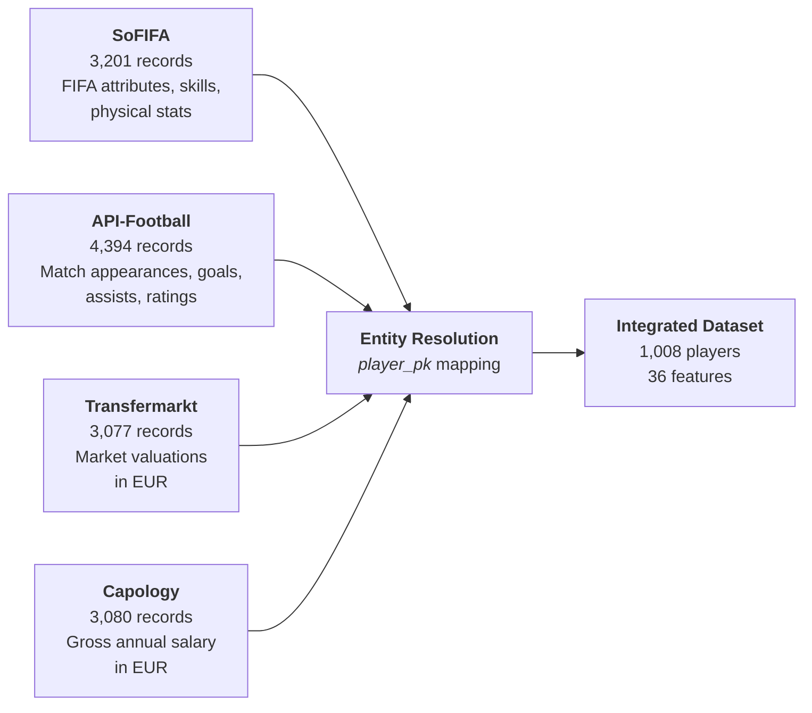

| Source | Table | Records | Key Fields |
|--------|-------|---------|------------|
| Capology | `salaries` | 3,080 | `gross_annual_eur`, contract details |
| SoFIFA | `sofifa_attributes` | 3,201 | Overall rating, potential, skills, traits, tags |
| API-Football | `player_stats` | 4,394 | Appearances, goals, assists, match ratings |
| Transfermarkt | `market_values` | 3,077 | Market value in EUR |

All data is stored in a SQLite database (`data/football_data.db`) with tables linked via `player_pk` through the `player_identity` bridge table.

### 3.2 Entity Resolution Pipeline

Players appear under different names and IDs across platforms. We use the `player_identity` table as a bridge:

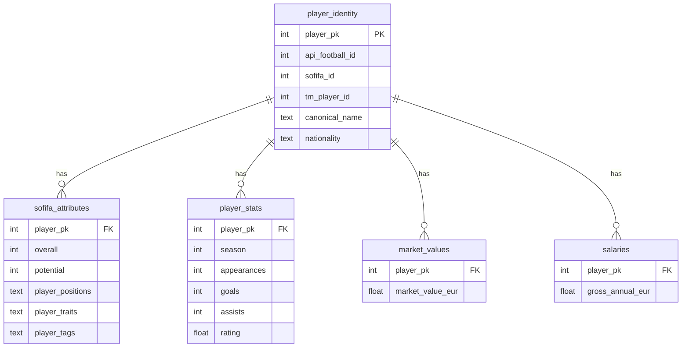

### 3.3 Data Integration Process

Tables are merged using left joins on `player_pk`, starting from the salaries table as the base. After merging, duplicate and administrative columns (IDs, URLs, scraping metadata) are removed.

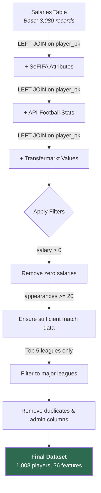

### 3.4 Filtering Criteria

| Filter | Threshold | Rationale |
|--------|-----------|-----------|
| Salary | `gross_annual_eur > 0` | Exclude missing/zero salary records |
| Appearances | `>= 20` | Ensure sufficient playing time for meaningful statistics |
| Leagues | Top 5 European | Premier League, La Liga, Serie A, Bundesliga, Ligue 1 |

### 3.5 Final Dataset Statistics

| Statistic | Value |
|-----------|-------|
| Total players | 1,008 |
| Features (engineered) | 36 |
| Mean salary | EUR 3,373,049 |
| Median salary | EUR 2,180,000 |
| Min salary | EUR 46,338 |
| Max salary | EUR 31,626,269 |
| Std deviation | EUR 3,571,192 |

**Players by League:**

| League | Players | Median Salary |
|--------|---------|---------------|
| Premier League | 233 | EUR 4,200,000 |
| Bundesliga | 203 | EUR 1,890,000 |
| La Liga | 188 | EUR 1,880,000 |
| Serie A | 229 | EUR 1,670,000 |
| Ligue 1 | 155 | EUR 1,550,000 |

---

## 4. Methodology

### 4.1 End-to-End ML Pipeline

The complete machine learning pipeline from raw data to deployed predictions:

```mermaid
flowchart TB
    subgraph DataPrep["<b>1. Data Preparation</b>"]
        direction TB
        A1[Raw Data<br/>4 sources] --> A2[Entity Resolution<br/><i>player_pk mapping</i>]
        A2 --> A3[Merge & Filter<br/><i>1,008 players</i>]
        A3 --> A4[Missing Value Imputation<br/><i>Median fill</i>]
    end

    subgraph FeatEng["<b>2. Feature Engineering</b>"]
        direction TB
        B1[21 Base Features] --> B2[Categorical Encoding<br/><i>Label + One-Hot</i>]
        B2 --> B3[Log Transforms<br/><i>4 monetary features</i>]
        B3 --> B4[Interaction Features<br/><i>7 derived ratios</i>]
        B4 --> B5["<b>36 Final Features</b>"]
    end

    subgraph Training["<b>3. Model Training</b>"]
        direction TB
        C1[Train/Test Split<br/><i>80/20, seed=42</i>] --> C2[StandardScaler<br/><i>For linear models</i>]
        C2 --> C3[10 Model Variants<br/><i>Linear + Tree + Ensemble</i>]
        C3 --> C4[GridSearchCV<br/><i>5-fold CV tuning</i>]
        C4 --> C5[Stacking Ensemble<br/><i>5 base + Ridge meta</i>]
    end

    subgraph RangePred["<b>4. Range Prediction</b>"]
        direction TB
        D1[Tuned Random Forest<br/><i>800 trees</i>] --> D2[Individual Tree<br/>Predictions]
        D2 --> D3["P25 = Low Bound<br/>P75 = High Bound<br/>Mean = Center"]
        D3 --> D4["Range Accuracy<br/><b>73.3%</b> @ 30% tolerance"]
    end

    subgraph Deploy["<b>5. Deployment</b>"]
        direction TB
        E1[FastAPI Server] --> E2[Live Data Integration<br/><i>API-Football</i>]
        E2 --> E3[Prediction + SHAP]
        E3 --> E4[LLM Explanation<br/><i>Google Gemini</i>]
    end

    DataPrep --> FeatEng --> Training --> RangePred --> Deploy

    style DataPrep fill:#1b4332,color:#fff
    style FeatEng fill:#2d6a4f,color:#fff
    style Training fill:#40916c,color:#fff
    style RangePred fill:#52b788,color:#000
    style Deploy fill:#74c69d,color:#000
```

### 4.2 Feature Engineering

#### 4.2.1 Base Features (21)

| Category | Features |
|----------|----------|
| SoFIFA Attributes | overall, potential, value_eur, wage_eur, age, international_reputation, shooting, passing, dribbling, defending, physic, league_level, movement_reactions, mentality_composure, release_clause_eur |
| Match Statistics | appearances, minutes, rating, goals, assists |
| Market Data | market_value_eur |

#### 4.2.2 Categorical Encoding

- `preferred_foot`: Label encoded (Left=0, Right=1)
- `position`: One-hot encoded with `drop_first=True` (Attacker as baseline), producing 3 dummy variables

#### 4.2.3 Engineered Features (11)

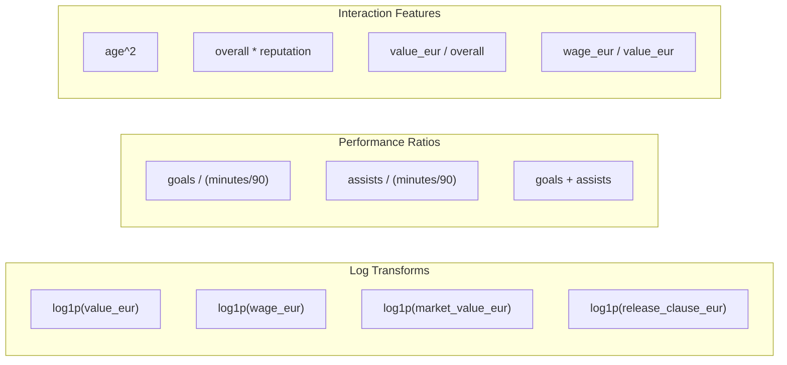

| Feature | Formula | Rationale |
|---------|---------|-----------|
| log_value_eur | log1p(value_eur) | Reduce skewness in monetary features |
| log_wage_eur | log1p(wage_eur) | Reduce skewness in monetary features |
| log_market_value | log1p(market_value_eur) | Reduce skewness in monetary features |
| log_release_clause | log1p(release_clause_eur) | Reduce skewness in monetary features |
| goals_per_90 | goals / (minutes / 90) | Normalize scoring rate by playing time |
| assists_per_90 | assists / (minutes / 90) | Normalize creation rate by playing time |
| goal_contributions | goals + assists | Total offensive output |
| age_squared | age^2 | Capture non-linear age-salary relationship (peak years) |
| overall_x_reputation | overall * international_reputation | Interaction between quality and fame |
| value_per_overall | value_eur / overall | Market premium per rating point |
| wage_to_value_ratio | wage_eur / value_eur | Wage efficiency indicator |

**Missing Value Handling:** Numeric NaN values filled with column medians. Infinite values (e.g., division by zero) replaced with 0.

### 4.3 Target Variable

The target variable is `log1p(gross_annual_eur)`. The log transformation addresses the strong right skew in the salary distribution:

$$y = \log(1 + \text{salary}_{\text{EUR}})$$

Predictions are converted back to EUR using the inverse transform:

$$\hat{\text{salary}}_{\text{EUR}} = e^{\hat{y}} - 1$$

### 4.4 Train/Test Split

- **Training set:** 806 players (80%)
- **Test set:** 202 players (20%)
- **Random state:** 42 (for reproducibility)
- **Feature scaling:** StandardScaler applied for linear models; tree-based models use raw features

### 4.5 Model Architecture

We evaluate three families of models and a meta-ensemble:

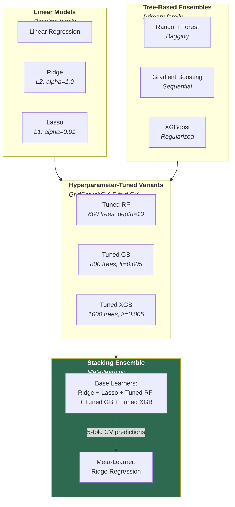

| Model | Type | Key Parameters |
|-------|------|----------------|
| Linear Regression | Baseline | Default |
| Ridge | L2 regularized | alpha=1.0 |
| Lasso | L1 regularized | alpha=0.01 |
| Random Forest | Bagging ensemble | n_estimators, max_depth, min_samples_leaf |
| Gradient Boosting | Sequential boosting | n_estimators, max_depth, learning_rate, subsample |
| XGBoost | Extreme gradient boosting | n_estimators, max_depth, learning_rate, reg_alpha, reg_lambda |
| Stacking Ensemble | Meta-learning | Ridge + Lasso + RF + GB + XGB, meta: Ridge |

### 4.6 Range Prediction Mechanism

Unlike traditional point prediction, we exploit the **ensemble nature of Random Forest** to produce salary intervals. Each of the 800 trees makes an independent prediction, and we use the distribution of those predictions to construct a range:

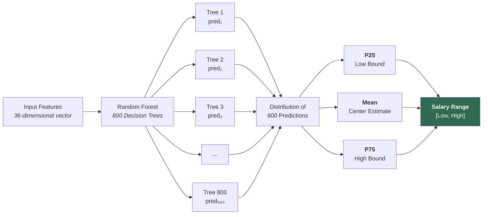

**Mathematical Formulation:**

Given a Random Forest with $T = 800$ trees, for input $\mathbf{x}$:

$$\text{pred}_t = f_t(\mathbf{x}), \quad t = 1, 2, \ldots, T$$

$$\text{low} = Q_{25}(\{\text{pred}_1, \text{pred}_2, \ldots, \text{pred}_T\})$$

$$\text{high} = Q_{75}(\{\text{pred}_1, \text{pred}_2, \ldots, \text{pred}_T\})$$

$$\text{center} = \frac{1}{T} \sum_{t=1}^{T} \text{pred}_t$$

**Range Accuracy Metric (with tolerance):**

$$\text{accurate}(i) = \begin{cases} \text{true} & \text{if } \text{low}_i \leq \text{actual}_i \leq \text{high}_i \\ \text{true} & \text{if actual}_i < \text{low}_i \text{ and } \frac{\text{low}_i - \text{actual}_i}{\text{actual}_i} \leq 0.30 \\ \text{true} & \text{if actual}_i > \text{high}_i \text{ and } \frac{\text{actual}_i - \text{high}_i}{\text{actual}_i} \leq 0.30 \\ \text{false} & \text{otherwise} \end{cases}$$

This approach naturally produces **variable-width ranges** -- tighter for predictable players (consensus among trees), wider for uncertain cases (disagreement among trees).

### 4.7 Evaluation Metrics

| Metric | Formula | Description |
|--------|---------|-------------|
| R² Score | $1 - \frac{\sum(y_i - \hat{y}_i)^2}{\sum(y_i - \bar{y})^2}$ | Proportion of variance explained |
| MAE | $\frac{1}{n}\sum\|y_i - \hat{y}_i\|$ | Mean absolute prediction error in EUR |
| RMSE | $\sqrt{\frac{1}{n}\sum(y_i - \hat{y}_i)^2}$ | Root mean squared error in EUR |
| Within 30% | $\frac{1}{n}\sum \mathbb{1}\left[\frac{\|y_i - \hat{y}_i\|}{y_i} \leq 0.30\right]$ | Point prediction accuracy |
| **Range Accuracy** | See formulation above | % of actuals within tolerance of range bounds |

### 4.8 Hyperparameter Tuning

GridSearchCV with 5-fold cross-validation was used to tune the tree-based models:

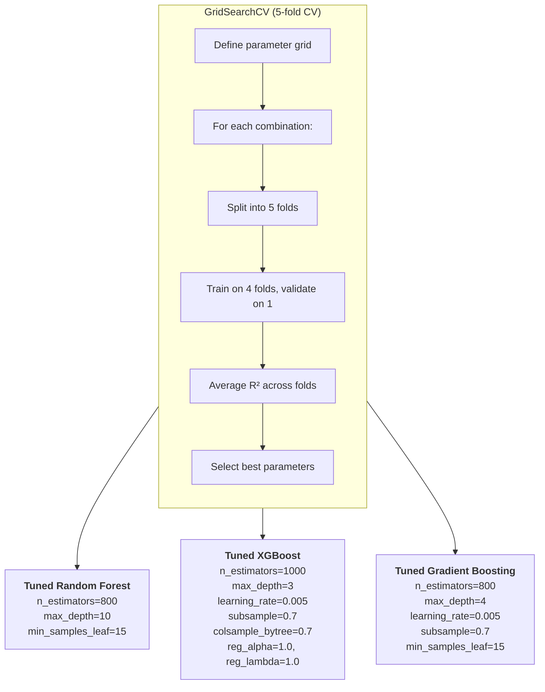

### 4.9 Stacking Ensemble Architecture

The stacking ensemble uses five base learners whose out-of-fold predictions are combined by a Ridge meta-learner:

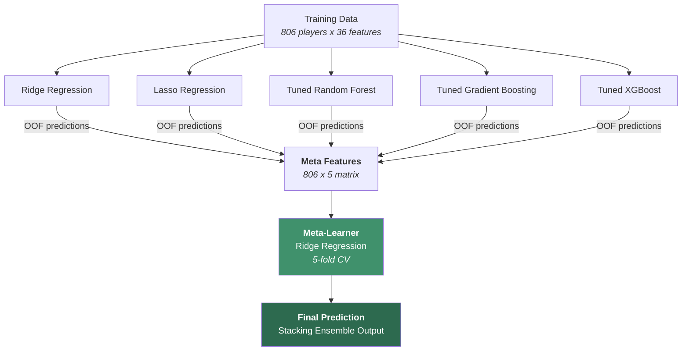

**Out-of-Fold (OOF) Prediction Process:**
1. Split training data into 5 folds
2. For each fold, train each base learner on the other 4 folds
3. Predict on the held-out fold
4. Concatenate predictions across folds to form meta-features
5. Train Ridge meta-learner on these meta-features

---

## 5. Experimental Results

### 5.1 Base Model Comparison

| Model | Train R² | Test R² | MAE (EUR) | Within 30% |
|-------|----------|---------|-----------|------------|
| Linear Regression | - | 0.7544 | 1,012,227 | 58.4% |
| Ridge | - | 0.7588 | 1,007,760 | 57.9% |
| Lasso | - | 0.7669 | 962,017 | 56.9% |
| Random Forest | - | 0.7060 | 1,144,103 | 55.9% |
| Gradient Boosting | - | 0.6821 | 1,156,918 | 53.0% |
| XGBoost | - | 0.6859 | 1,171,124 | 50.0% |

### 5.2 Tuned Model Performance

| Model | Test R² | MAE (EUR) | Within 30% | Range Accuracy |
|-------|---------|-----------|------------|----------------|
| Tuned RF | 0.7119 | 1,159,936 | 53.0% | **73.3%** |
| Tuned XGBoost | 0.7339 | 1,090,470 | 52.5% | **73.3%** |
| Tuned GB | 0.7355 | 1,080,967 | 56.9% | **73.3%** |
| **Stacking Ensemble** | **0.7609** | **1,014,246** | **56.9%** | **73.3%** |

### 5.3 Key Findings

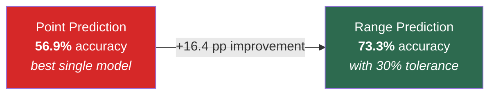

1. **Range prediction outperforms point prediction by +16.4 percentage points** (73.3% vs 56.9%), demonstrating that interval estimates provide substantially better practical accuracy
2. **Stacking ensemble achieves the highest R² (0.7609)** and lowest MAE (EUR 1,014,246), confirming that meta-learning effectively combines complementary model strengths
3. **Log-transformed monetary features dominate** predictions -- `log_wage_eur`, `log_value_eur`, and `log_market_value` are the top 3 features by importance
4. **All tree-based models achieve identical range accuracy (73.3%)**, suggesting the range width is robust to model choice

### 5.4 Feature Importance Analysis

The top features driving salary predictions (from Random Forest importance):

| Rank | Feature | Importance | Interpretation |
|------|---------|------------|----------------|
| 1 | **log_wage_eur** | Highest | FIFA weekly wage is the strongest proxy for actual salary |
| 2 | **log_value_eur** | Very High | FIFA player value captures market perception |
| 3 | **log_market_value** | High | Transfermarkt valuation reflects real-world market |
| 4 | **overall** | High | Overall player quality rating |
| 5 | **international_reputation** | Moderate | Fame and brand value impact earnings |

SHAP (SHapley Additive exPlanations) analysis provides per-prediction feature contributions, enabling explainable salary estimates for each individual player.

---

## 6. System Architecture and Deployment

### 6.1 High-Level Architecture

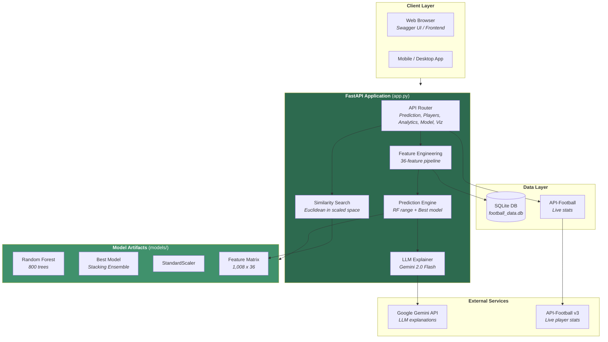

### 6.2 Prediction Flow (Live Endpoint)

The `/api/predict/live/{api_football_id}` endpoint orchestrates multiple data sources in real time:

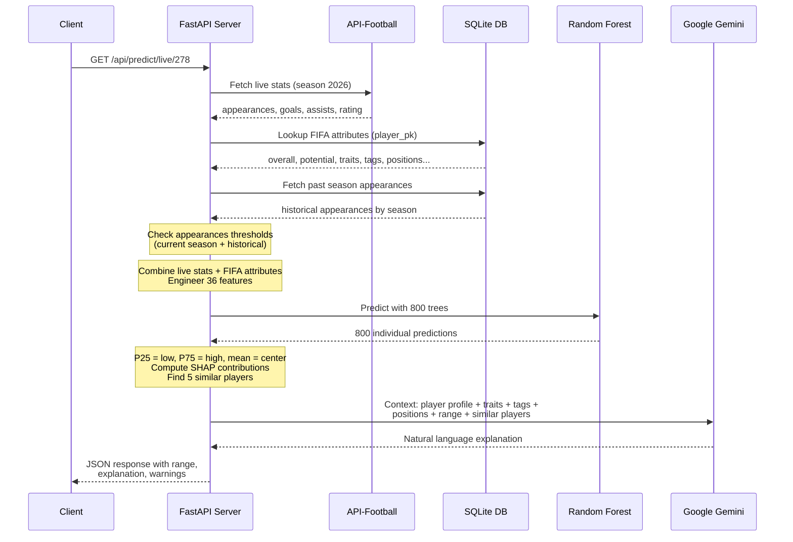

### 6.3 Appearances Warning System

The system provides two levels of data sufficiency warnings:

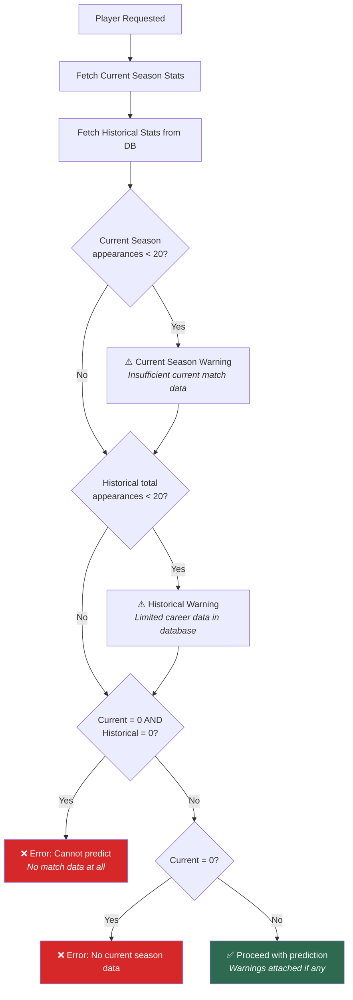

### 6.4 LLM Explanation Pipeline

Each prediction includes a natural language explanation generated by **Google Gemini** (gemini-2.0-flash). The LLM receives rich context about the player:

```mermaid
flowchart LR
    subgraph Context["<b>LLM Context</b>"]
        direction TB
        C1["Player profile<br/><i>name, age, club, league</i>"]
        C2["Positions & versatility<br/><i>e.g. CAM, CM, RW</i>"]
        C3["Player traits<br/><i>e.g. Relentless, Playmaker</i>"]
        C4["Player tags<br/><i>e.g. #Clinical finisher</i>"]
        C5["Skill moves & weak foot"]
        C6["Predicted range + percentile"]
        C7["Top 5 SHAP contributions"]
        C8["3 most similar players"]
    end

    Context --> LLM["<b>Google Gemini</b><br/><i>gemini-2.0-flash</i>"]
    LLM --> Output["Natural Language<br/>Explanation"]

    Output --> Example["<i>'Bellingham's predicted range of<br/>EUR 8M-12M reflects his elite<br/>Playmaker vision and Relentless<br/>work ethic. His versatility to<br/>play CAM and CM adds...'</i>"]

    style LLM fill:#40916c,color:#fff
```

The prompt instructs the LLM to write like a football pundit -- conversational, engaging, and focused on **why** the player deserves the predicted salary. It references traits, tags, positional versatility, and similar player comparisons. A template-based fallback ensures the API works without an LLM API key.

### 6.5 Endpoint Summary

#### Prediction Endpoints
| Method | Endpoint | Description |
|--------|----------|-------------|
| **GET** | **`/api/predict/live/{api_football_id}`** | **Primary: predict using LIVE data from API-Football** |
| POST | `/api/predict` | Predict salary range from raw attributes |
| GET | `/api/predict/{player_pk}` | Predict for a database player |
| POST | `/api/predict/batch` | Batch predictions by api_football_id |

#### Player Endpoints
| Method | Endpoint | Description |
|--------|----------|-------------|
| GET | `/api/players` | Paginated player list with filters |
| GET | `/api/players/search?q=` | Search players by name (includes api_football_id) |
| GET | `/api/players/lookup?q=` | Look up api_football_id by player name |
| GET | `/api/players/search-api?q=` | Search API-Football for a player by name |
| GET | `/api/players/top-overpaid` | Most overpaid players |
| GET | `/api/players/top-underpaid` | Most underpaid players |
| GET | `/api/players/{player_pk}` | Full player details |

#### Analytics Endpoints
| Method | Endpoint | Description |
|--------|----------|-------------|
| GET | `/api/analytics/overview` | Dataset overview statistics |
| GET | `/api/analytics/leagues` | Salary stats by league |
| GET | `/api/analytics/positions` | Salary stats by position |
| GET | `/api/analytics/age-analysis` | Salary by age analysis |
| GET | `/api/analytics/salary-factors` | Feature importance rankings |
| GET | `/api/analytics/compare?pks=` | Side-by-side comparison |

#### Model & Visualization Endpoints
| Method | Endpoint | Description |
|--------|----------|-------------|
| GET | `/api/model/metrics` | All model metrics |
| GET | `/api/model/feature-importances` | Feature importance rankings |
| GET | `/api/model/summary` | Best model summary |
| GET | `/api/visualizations` | List available graphs |
| GET | `/api/visualizations/{name}` | Serve graph image |

### 6.6 Example API Response

```json
{
    "predicted_range": {
        "low_eur": 3500000,
        "high_eur": 6500000,
        "center_eur": 5000000,
        "low_display": "EUR 3,500,000",
        "high_display": "EUR 6,500,000",
        "range_width_pct": 60.0
    },
    "actual_salary_eur": 5200000,
    "actual_in_range": true,
    "range_accuracy_result": true,
    "percentile_rank": 72.3,
    "feature_contributions": { "..." },
    "similar_players": [ "..." ],
    "llm_explanation": "Bellingham's predicted salary range of EUR 3.5M-6.5M reflects his elite Playmaker vision and Relentless work ethic at Real Madrid. His ability to operate as both a CAM and CM adds tactical versatility that few midfielders offer...",
    "model_used": "StackingEnsemble",
    "warnings": []
}
```

---

## 7. Visualizations and Analysis

### 7.1 Original Figures (10)

| Figure | Description | Key Insight |
|--------|-------------|-------------|
| salary_distribution | Raw and log-transformed salary distributions | Strong right skew justified log-transform of target |
| top_correlations | Top 20 features correlated with salary | Monetary features (value, wage, market value) dominate |
| correlation_heatmap | Correlation matrix of key features | High collinearity between value_eur and market_value_eur |
| salary_by_position_league | Salary by position and league (box plots) | Premier League pays significantly more across all positions |
| scatter_plots | Feature vs salary scatter plots | Non-linear relationships visible in age and overall |
| model_comparison | R² and Within 30% accuracy comparison | Linear models competitive with tree-based on R² |
| actual_vs_predicted | Best initial model predictions | Systematic underprediction for top earners |
| residual_plots | Residuals vs predicted and residual distribution | Heteroscedasticity at high salary levels |
| feature_importance | Top 20 feature importances | log_wage_eur dominates predictions |
| final_actual_vs_predicted | Final model predictions | Improved calibration after tuning |

### 7.2 Academic Figures (16)

| Figure | Description | Key Insight |
|--------|-------------|-------------|
| shap_summary | SHAP beeswarm plot | Global feature importance with directionality |
| shap_dependence_overall | SHAP dependence for overall rating | Threshold effect around overall=80 |
| shap_dependence_value_eur | SHAP dependence for log(FIFA value) | Strong positive monotonic relationship |
| shap_dependence_wage_eur | SHAP dependence for log(wage) | Most influential single feature |
| shap_dependence_market_value | SHAP dependence for log(market value) | Corroborates value_eur importance |
| learning_curves | Training vs validation score by training set size | No significant overfitting with 800+ samples |
| prediction_error_distribution | Histogram of prediction errors | Most errors within EUR 1M; heavy right tail |
| cv_boxplots | 5-fold cross-validation R² box plots | Stacking shows most consistent performance |
| cumulative_accuracy | Cumulative accuracy curve | 80% accuracy achievable at 40% tolerance |
| complexity_vs_performance | Model complexity vs R² and accuracy | Diminishing returns beyond 500 estimators |
| league_salary_violin | Violin plots of salary distribution by league | Bimodal distribution in Premier League |
| salary_age_curves | Salary vs age by position with smoothed curves | Peak earning age: 27-29 years |
| position_radar | Average attribute radar charts by position | Distinct skill profiles per position |
| overpaid_underpaid_scatter | Actual vs predicted colored by status | Overpaid cluster in 25-30 age bracket |
| residuals_by_league_position | Residual box plots by league and position | Largest residuals for Premier League attackers |
| range_prediction_plot | Predicted ranges vs actual salaries | Variable-width ranges adapt to uncertainty |

---

## 8. Discussion

### 8.1 Strengths

- **Range prediction provides actionable uncertainty estimates** rather than false precision of point estimates
- **Multi-source integration** captures player value from multiple perspectives (skill, performance, market, salary)
- **Explainable predictions** through SHAP + LLM make the system accessible to non-technical users
- **Live data integration** enables predictions for any player with an API-Football ID

### 8.2 Limitations

- **Sample size** of 1,008 players limits representation of edge cases (very young/old players, lower leagues)
- **FIFA attribute dependency** means the model cannot predict for players not in the SoFIFA database
- **Temporal dynamics** are not captured -- contract year effects, injury history, and form trends are excluded
- **League-specific factors** (TV deals, FFP compliance, club revenue) are only indirectly captured through league_level

### 8.3 Future Work

- Incorporate temporal features (form over last N matches, career trajectory)
- Add contract-specific features (years remaining, signing bonus, performance bonuses)
- Extend to lower-division leagues and women's football
- Explore deep learning approaches (player embeddings, graph neural networks for team context)
- Implement online learning to update predictions as new season data arrives

---

## 9. How to Run

### 9.1 Prerequisites

- Python 3.10+
- pip package manager

### 9.2 Installation

```bash
# Clone the repository
git clone <repository-url>
cd AIMODELFINALLSSS

# Install dependencies
pip install -r requirements.txt
```

### 9.3 Training the Model

Run the model training script to generate all artifacts:

```bash
python scripts/save_model.py
```

This trains all models, performs hyperparameter tuning, and saves artifacts to `models/`.

### 9.4 Generating Academic Graphs

```bash
python scripts/generate_graphs.py
```

Generates 16 additional visualizations in `figures_api/`.

### 9.5 Starting the API

```bash
# Set up API keys
cp .env.example .env
# Edit .env and add:
#   FOOTBALL_API_KEY=your_key   (required for live predictions)
#   GEMINI_API_KEY=your_key     (optional, for LLM explanations)

# Start the server
python -m uvicorn app:app --reload
```

The API will be available at `http://localhost:8000`.

### 9.6 API Documentation

- **Swagger UI**: http://localhost:8000/docs
- **ReDoc**: http://localhost:8000/redoc

---

## 10. Project Structure

```
AIMODELFINALLSSS/
├── app.py                              # FastAPI application (all endpoints)
├── football_salary_prediction.py       # Original ML pipeline
├── football_salary_prediction.ipynb    # Jupyter notebook version
├── requirements.txt                    # Python dependencies
├── .env.example                        # Environment variable template
├── README.md                           # This file
├── data/
│   └── football_data.db                # SQLite database (5 tables)
├── models/                             # Trained model artifacts
│   ├── best_model.joblib               # Best tuned model (Stacking Ensemble)
│   ├── rf_model.joblib                 # Random Forest (800 trees, for range predictions)
│   ├── all_models.joblib               # All 10 trained models
│   ├── scaler.joblib                   # StandardScaler
│   ├── feature_names.joblib            # 36 feature column names
│   ├── label_encoder_foot.joblib       # Preferred foot encoder
│   ├── feature_medians.joblib          # Imputation medians
│   ├── position_categories.joblib      # Position categories
│   ├── all_predictions.joblib          # Pre-computed predictions (1,008 players)
│   ├── feature_matrix.joblib           # Feature matrix for similarity search
│   ├── model_config.json               # Model configuration & hyperparameters
│   ├── model_metrics.json              # Performance metrics for all models
│   ├── feature_importances.json        # Feature importances (RF + Best)
│   └── dataset_stats.json              # Dataset statistics
├── scripts/
│   ├── save_model.py                   # Model training and saving
│   └── generate_graphs.py             # Academic visualization generation
├── figures/                            # Original visualizations (10 PNG)
└── figures_api/                        # Academic visualizations (16 PNG)
```

---

## 11. Technologies Used

| Technology | Purpose |
|------------|---------|
| Python 3.13 | Programming language |
| scikit-learn | ML models, preprocessing, evaluation, stacking |
| XGBoost | Extreme gradient boosting implementation |
| SHAP | Explainable AI / per-prediction feature contributions |
| FastAPI | Async REST API framework with auto-generated docs |
| Google Gemini | LLM-powered natural language salary explanations |
| pandas / NumPy | Data manipulation and numerical computing |
| matplotlib / seaborn | Statistical data visualization |
| SQLite | Lightweight relational data storage |
| joblib | Model serialization and artifact management |

---

## 12. References

1. Lundberg, S. M., & Lee, S. I. (2017). A unified approach to interpreting model predictions. *Advances in Neural Information Processing Systems*, 30.
2. Chen, T., & Guestrin, C. (2016). XGBoost: A scalable tree boosting system. *Proceedings of the 22nd ACM SIGKDD International Conference on Knowledge Discovery and Data Mining*.
3. Breiman, L. (2001). Random forests. *Machine Learning*, 45(1), 5-32.
4. Wolpert, D. H. (1992). Stacked generalization. *Neural Networks*, 5(2), 241-259.
5. Hakes, J. K., & Sauer, R. D. (2006). An economic evaluation of the Moneyball hypothesis. *Journal of Economic Perspectives*, 20(3), 173-186.
6. He, M., Cachucho, R., & Knobbe, A. (2015). Football player's performance and market value. *Proceedings of the 2nd Workshop on Machine Learning and Data Mining for Sports Analytics*.
7. Muller, O., Simons, A., & Weinmann, M. (2017). Beyond crowd judgments: Data-driven estimation of market value in association football. *European Journal of Operational Research*, 263(2), 611-624.
8. SoFIFA. FIFA Player Database. https://sofifa.com
9. Transfermarkt. Football Player Market Values. https://www.transfermarkt.com
10. Capology. Football Player Salaries. https://www.capology.com
11. API-Football. Football Statistics API. https://www.api-football.com

---

## Appendix A: Full Feature List

| # | Feature | Type | Source | Description |
|---|---------|------|--------|-------------|
| 1 | overall | Numeric | SoFIFA | Overall player quality rating (1-99) |
| 2 | potential | Numeric | SoFIFA | Maximum potential rating |
| 3 | value_eur | Numeric | SoFIFA | FIFA estimated player value in EUR |
| 4 | wage_eur | Numeric | SoFIFA | FIFA weekly wage in EUR |
| 5 | age | Numeric | SoFIFA | Player age in years |
| 6 | international_reputation | Numeric | SoFIFA | International fame (1-5 stars) |
| 7 | shooting | Numeric | SoFIFA | Shooting ability composite |
| 8 | passing | Numeric | SoFIFA | Passing ability composite |
| 9 | dribbling | Numeric | SoFIFA | Dribbling ability composite |
| 10 | defending | Numeric | SoFIFA | Defending ability composite |
| 11 | physic | Numeric | SoFIFA | Physical attributes composite |
| 12 | league_level | Numeric | SoFIFA | League competitive tier |
| 13 | movement_reactions | Numeric | SoFIFA | Reaction speed attribute |
| 14 | mentality_composure | Numeric | SoFIFA | Composure under pressure |
| 15 | release_clause_eur | Numeric | SoFIFA | Contract release clause in EUR |
| 16 | appearances | Numeric | API-Football | Season match appearances |
| 17 | minutes | Numeric | API-Football | Total minutes played |
| 18 | rating | Numeric | API-Football | Average match rating |
| 19 | goals | Numeric | API-Football | Goals scored in season |
| 20 | assists | Numeric | API-Football | Assists provided in season |
| 21 | market_value_eur | Numeric | Transfermarkt | Market valuation in EUR |
| 22 | preferred_foot | Encoded | SoFIFA | Left=0, Right=1 |
| 23 | pos_Defender | One-hot | Derived | 1 if Defender position |
| 24 | pos_Goalkeeper | One-hot | Derived | 1 if Goalkeeper position |
| 25 | pos_Midfielder | One-hot | Derived | 1 if Midfielder position |
| 26 | log_value_eur | Engineered | Derived | log1p(value_eur) |
| 27 | log_wage_eur | Engineered | Derived | log1p(wage_eur) |
| 28 | log_market_value | Engineered | Derived | log1p(market_value_eur) |
| 29 | log_release_clause | Engineered | Derived | log1p(release_clause_eur) |
| 30 | goals_per_90 | Engineered | Derived | Scoring rate per 90 minutes |
| 31 | assists_per_90 | Engineered | Derived | Creation rate per 90 minutes |
| 32 | goal_contributions | Engineered | Derived | Total goals + assists |
| 33 | age_squared | Engineered | Derived | Captures non-linear age effect |
| 34 | overall_x_reputation | Engineered | Derived | Quality-fame interaction |
| 35 | value_per_overall | Engineered | Derived | Market premium per rating point |
| 36 | wage_to_value_ratio | Engineered | Derived | Wage efficiency metric |
